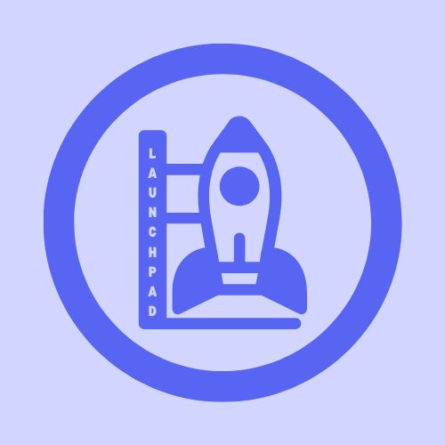

<!--
Credit for this README where credit's due:
- https://github.com/othneildrew/Best-README-Template/blob/main/README.md
- https://github.com/Louis3797/awesome-readme-template

These two templates have been extremely helpful when creating my own README template
and I've drawn inspiration from them heavily.

Please keep this acknowledgement in further modifications of the README file, though
it's not like I can tell you what to do. I'm just a comment in a text file.

Copyright 2025 (c) HyScript7
-->

  <!-- Logo or Icon -->
  
  <h1>Launchpad Framework</h1>
  <!-- Badges -->
  

  
    
  

  <!-- Short Description -->
  

  A batteries-included framework for developing discord bots with persistent
  data storage and an API.
  

## 🚀 About

Launchpad is a python framework built around discord.py that enables you
to easily create a modular discord bot along with an API, which should make
it easier to introduce a web dashboard later on.

We created this framework, because we often duplicated "loader" code across
our discord bot projects, and it has become an endeavour to maintain them
all.

## 🛠️ Built with

## 🏁 Getting started

Coming soon.

## ✉️ Support

If you encounter any issues or have questions, feel free to:

- Open an issue in the [Issues tab](https://github.com/launchpadfw/launchpad/issues).
- Contact us via our discord server: Coming soon!

We’re here to help!

## 📄 License

This project is licensed under the **[MIT License](LICENSE)** - feel free to use, modify, and distribute this project in accordance with the license terms.

## 💖 Acknowledgments

We would like to express our deepest gratitude to the following individuals and organizations:

- [Discord.py by Rapptz](https://github.com/Rapptz/discord.py) - this framework wouldn't be possible without this already awesome library!
- [FastAPI by Tiangolo](https://github.com/fastapi/fastapi) - which was used for the API aspect of this framework.
